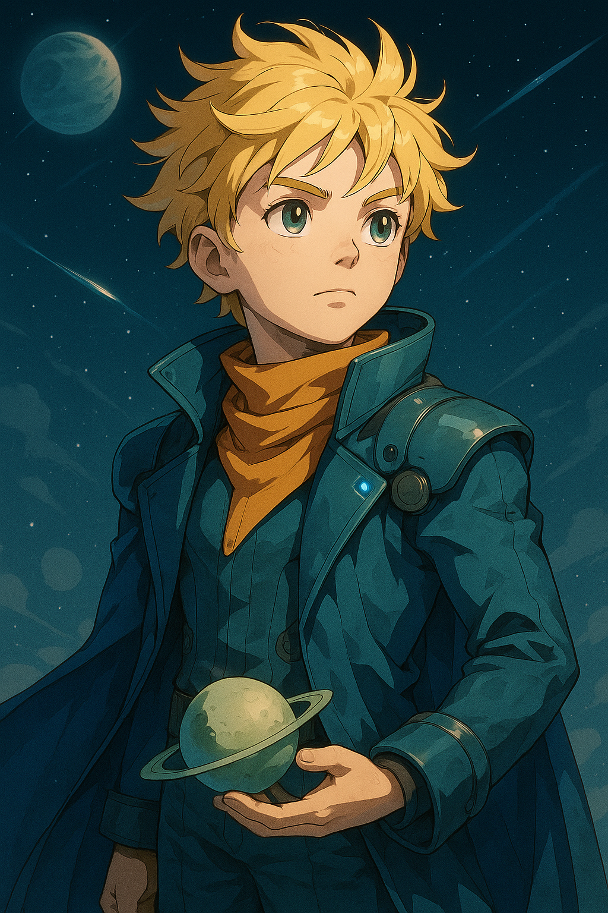
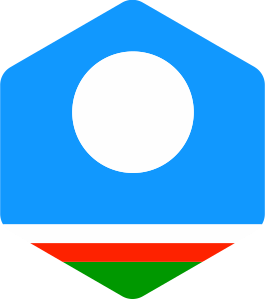

# 📗 The Little Prince

This book is created using the `lingtrain aligner` library, which enables the creation of multilingual parallel texts. It provides tools for aligning sentences across different languages, making it easier to create and study parallel versions of books like 'The Little Prince' by Antoine de Saint-Exupéry.

👉 Book is here: https://averkij.github.io/prince

## Languages

This parallel book is available in the following languages:

| Flag | Language |
|---|---|
|  | Altai |
|  | Bashkir |
|  | Chuvash |
|  | Digoron |
|  | Erzya |
|  | French |
|  | Kazakh |
|  | Kalmyk |
|  | Khakas |
|  | Karachay-Balkar |
|  | Komi |
|  | Kubachi |
|  | Mari |
|  | Moksha |
|  | Hill Mari |
|  | Orok |
|  | Russian |
|  | Tatar |
|  | Yakut |
|  | Udmurt |

## Thank you

Special thanks to all the translators and contributors who made this multilingual parallel book possible!
